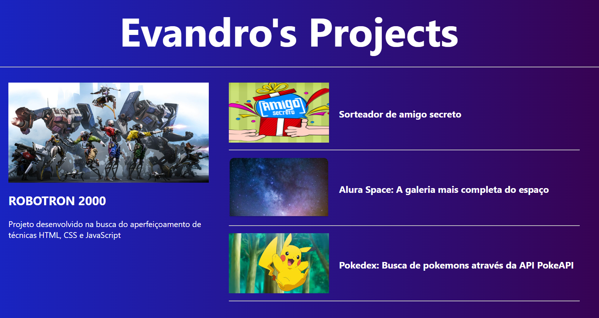

# Blog de Projetos do GitHub com Angular

Projeto desenvolvido para treinar a utilização do framework Angular, conhecendo ainda mais suas ferramentas.

## Ideia do Projeto

Desenvolvido pensando em mostrar, em formato de blog, os repositórios do meu GitHub. Inicialmente colocando artigos principais e secundários, depois listando todos os repositórios através da API do GitHub.
